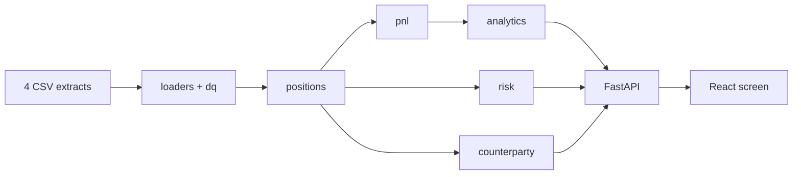
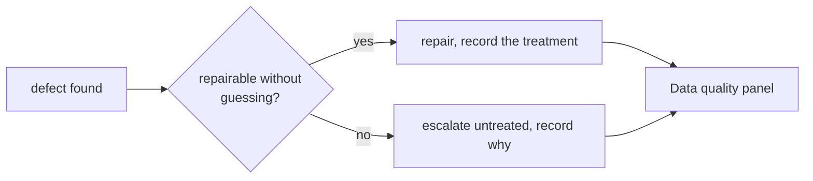

# Risk & P&L — Asia cross-asset desk

A working risk and P&L tool for four books out of Asia — rates, credit, FX and
equity derivatives — built on extracts from the desk's source systems.
Reporting currency **USD**, as of **2026-08-05**, with the whole month
replayable day by day.



Dependencies run one way only. Every engine is testable without starting a web
server, which is why the numbers can be checked without the screen.

## Run it

**Python 3.11–3.14, Node 18+.** Drop the four extracts into `data/` — they are
gitignored and never committed.

```bash
python3 -m venv .venv && source .venv/bin/activate && pip install -r backend/requirements.txt && PYTHONPATH=backend uvicorn app.main:app --reload
```

```bash
cd frontend && npm install && npm run dev
```

Then <http://localhost:5173>. API docs at <http://localhost:8000/docs>.

**Tests:** `python -m pytest` and `cd frontend && npm test` — 189 + 124, and
they pass on a fresh clone **with no `data/` directory at all**, against
hand-written fixtures that reproduce the real quirks.

## What it shows

| View | Answers |
|---|---|
| **Desk summary** | Where does each book stand, what moved overnight, and is it a position we still have? |
| **Positions** | What do we hold, netted by book and instrument, and what has settled? |
| **Risk** | What are we exposed to, where on the curve does it sit, and who are we facing? |
| **Data quality** | What was wrong with the data, and what did the tool do about it? |

## Nothing is repaired silently



**32 findings** on this extract — 5 errors, 23 warnings, 4 benign — each shown
with what the tool did about it. A figure a trader disputes at 07:30 is only
useful if we can say exactly what changed underneath it.

## The three things the data hid

**No contract multiplier exists anywhere in the extracts.** Equity trades book
a notional of 0 and a quantity in contracts. Left at 1, the Nikkei book is
wrong by a factor of 1,000 and still looks entirely plausible on screen. The
values were recovered by inverting the risk file's own identity, cross-checked
on independent trades — and HSI, which has no future to invert, is labelled
*corroborated, not derived*.

**A naive settlement rule empties the book.** 34 of 40 trades have a settlement
date in the past. Settlement ends an FX spot and *starts* a bond. And the NDFs
carry a spot-leg `settle_date` while running to maturity a month later.

**Notional is not exposure, and it is not even comparable.** Summed raw across
JPY, KRW and USD, one counterparty is 61% of the book and first by a distance;
in USD it is 9.4% and sixth; by what a default would actually cost, 4.5%.

## What it does not do

FX forwards and NDFs are marked on spot: `fx_rates.csv` has no forward points,
so the rate differential is absent from **267k USD, about 60% of the desk
total**. Stated here rather than buried, because it is the largest
approximation in the tool.

---

**Detail:** [Design decisions and architecture](docs/DESIGN.md) ·
[What the extracts turned out to contain](docs/DATA.md) — the 32 findings in
full, four things found beyond the brief, three questions left open for the
desk.
