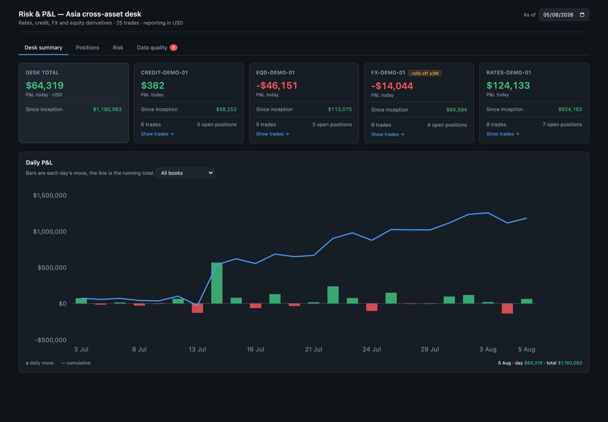
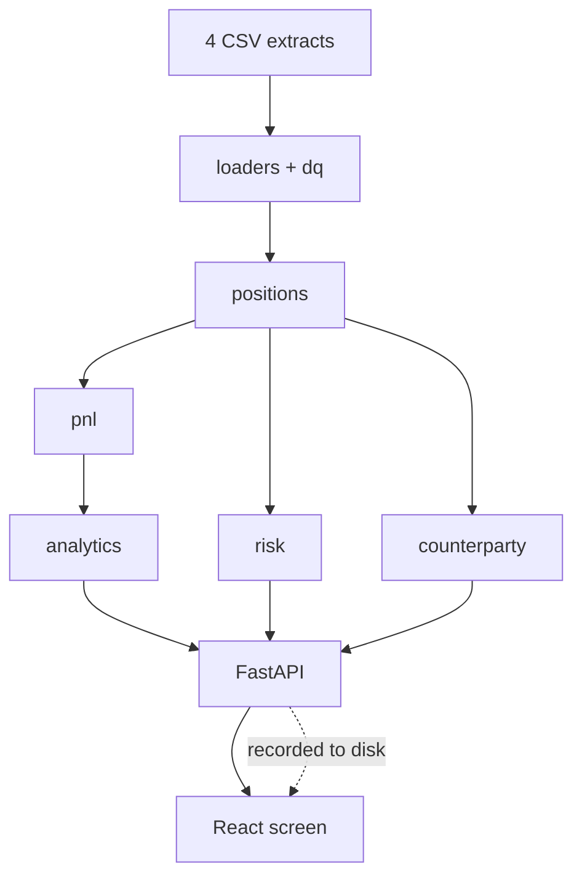
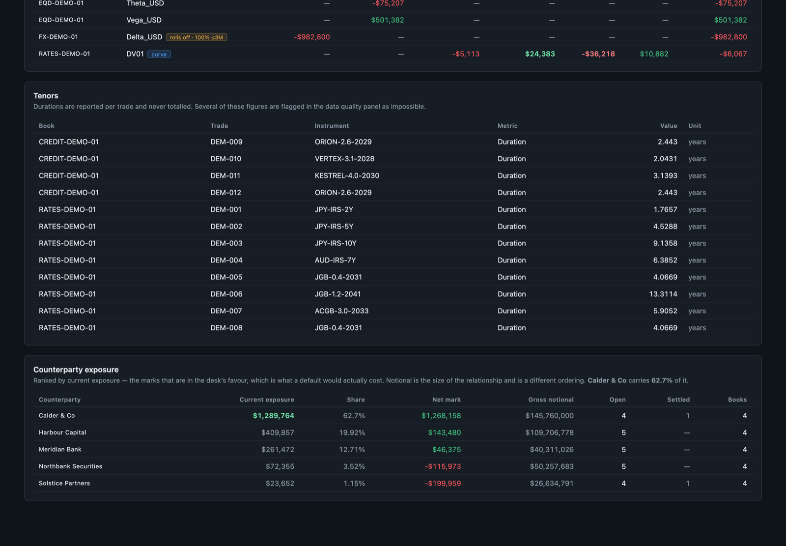
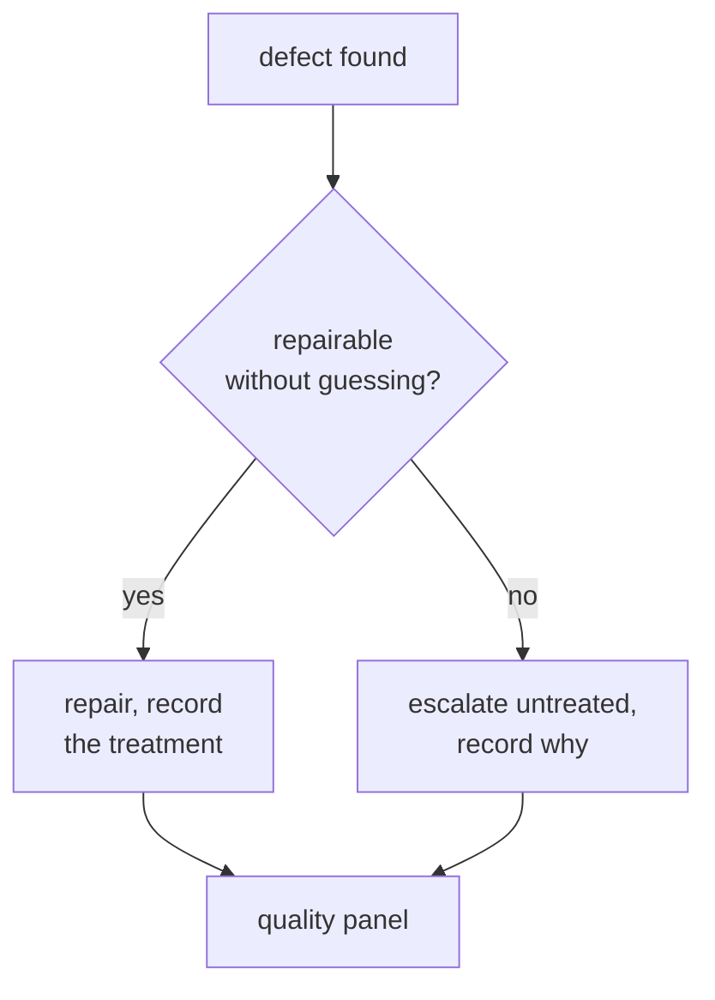
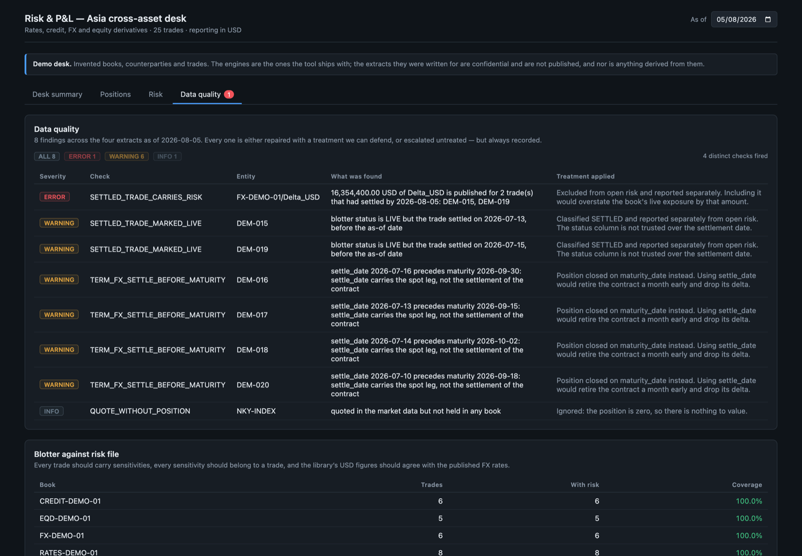

# Risk & P&L — Asia cross-asset desk

[](https://github.com/akaloic/risk-pnl-dashboard/actions/workflows/ci.yml)

A working risk and P&L tool for four books out of Asia — rates, credit, FX and
equity derivatives — built on extracts from the desk's source systems.
Reporting currency **USD**, as of **2026-08-05**, with the whole month
replayable day by day.

## ▶ [Open the screen](https://akaloic.github.io/risk-pnl-dashboard/) — nothing to install

The desk in it is invented. The extracts this was written for are confidential,
and a figure derived from them is no more publishable than the file it came
from, so the published screen runs on a synthetic desk instead. The engines
underneath are the ones in this repository, unchanged.

[](https://akaloic.github.io/risk-pnl-dashboard/)

## How it fits together



Dependencies run one way only, and every engine is testable without starting a
web server — which is why the numbers can be checked without the screen.

That dashed arrow is how a tool with a Python backend is one click away: Pages
serves files and runs nothing, so the build drives the real API and writes down
every answer, one directory per business day. The same screen reads either. It
is a recording of the API rather than a mock of it — change a route and the
recording changes with it.

## The three things the data hid

**No contract multiplier exists anywhere in the extracts.** Equity trades book
a notional of 0 and a quantity in contracts. Left at 1, the Nikkei book is
wrong by a factor of 1,000 and still looks entirely plausible on screen. The
values were recovered by inverting the risk file's own identity, cross-checked
on independent trades — and HSI, which has no future to invert, is labelled
*corroborated, not derived*.

**A naive settlement rule empties the book.** 34 of 40 trades have a settlement
date in the past. Settlement ends an FX spot and *starts* a bond. And the NDFs
carry a spot-leg `settle_date` while running to maturity a month later.

**Notional is not exposure, and it is not even comparable.** Summed raw across
JPY, KRW and USD, one counterparty is 61% of the open notional and first by a
distance; in USD it is 10% and fifth of nine; by what a default would actually
cost, 4.5%.



## Nothing is repaired silently



**32 findings** on this extract — 5 errors, 23 warnings, 4 benign — each shown
with what the tool did about it. A figure a trader disputes at 07:30 is only
useful if we can say exactly what changed underneath it.



## The rest of the screen

**[Drill-down](docs/screenshots/02-trade-detail.png)** — the trades behind a
figure, biggest first. `leg` marks lines that share an instrument and are one
position: read separately, DEM-021 looks like an 89k loss, and it is half of a
position that made 14k.

**[Risk](docs/screenshots/04-risk.png)** — what the desk is exposed to and
where on the curve it sits, settled exposure kept beside open, with `curve`
marking a row holding exposure on both sides of zero.

**[Positions](docs/screenshots/03-positions.png)** — what is held, netted by
book and instrument.

## Run it on the real extracts

**Python 3.11–3.14, Node 18+.** Drop `trades.csv`, `market_data.csv`,
`risk_sensitivities.csv` and `fx_rates.csv` into `data/` — gitignored, never
committed — then, in two terminals:

```bash
python3 -m venv .venv && source .venv/bin/activate && pip install -r backend/requirements.txt && PYTHONPATH=backend uvicorn app.main:app --reload
```

```bash
cd frontend && npm install && npm run dev
```

<http://localhost:5173>, with API docs at <http://localhost:8000/docs>. Swap
in the synthetic desk with `RAD_DATA_DIR=demo-data` on the first command.

**Tests:** `python -m pytest` and `cd frontend && npm test` — 189 + 136, and
they pass on a fresh clone **with no `data/` directory at all**, against
hand-written fixtures that reproduce the real quirks.

## What it does not do

FX forwards and NDFs are marked on spot: `fx_rates.csv` has no forward points,
so the rate differential is absent from **267k USD, about 60% of the desk
total**. Stated here rather than buried, because it is the largest
approximation in the tool.

---

**Detail:** [Design decisions and architecture](docs/DESIGN.md) ·
[What the extracts turned out to contain](docs/DATA.md) — the 32 findings in
full, four things found beyond the brief, three questions left open for the
desk.
